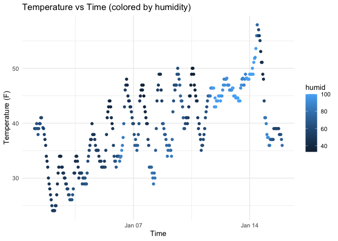

p8105_hw1_hc3671
================
Barry
2025-09-15

Loading package and data set

``` r
library(moderndive)
data("early_january_weather")
```

# Problem 1

**The description of data set:**

This data set records the weather condition in EWR from 1st to fifteenth
of January in 2013. The weather condition includes variables liketemp,
dewp, humid, wind_dir, wind_speed, wind_gust, precip, pressure, visib,
time_hour which refers to temperature, dew point, humidity, wind
direction,wind speed, wind gust, precipitation, pressure, visibility and
record times.  
This data set has 15 columns and 358 row.  
The mean temperature is 39.5821229.

Make a plot of temperature and time_hour

``` r
library(ggplot2)

weather_plot <- ggplot(early_january_weather, aes(x = time_hour, y = temp, color = humid)) +
  geom_point() +
  labs(title = "Temperature vs Time (colored by humidity)", x = "Time", y = "Temperature (F)") +
  theme_minimal()

weather_plot
```

<!-- -->

``` r
ggsave("scatterplot_of_weather.png", plot = weather_plot)
```

    ## Saving 7 x 5 in image

According to the plot, from the 1st to the 15th, the overall temperature
shows an upward trend, with a regular daily cycle of lower temperatures
in the morning and evening and higher temperatures around midday. At the
same time, humidity is inversely related to temperature — in most cases,
lower temperatures are associated with higher humidity.

# Problem 2

First, we need to create a data frame includes different variables:

``` r
library(tidyverse)
```

    ## ── Attaching core tidyverse packages ──────────────────────── tidyverse 2.0.0 ──
    ## ✔ dplyr     1.1.4     ✔ readr     2.1.5
    ## ✔ forcats   1.0.0     ✔ stringr   1.5.1
    ## ✔ lubridate 1.9.4     ✔ tibble    3.3.0
    ## ✔ purrr     1.1.0     ✔ tidyr     1.3.1
    ## ── Conflicts ────────────────────────────────────────── tidyverse_conflicts() ──
    ## ✖ dplyr::filter() masks stats::filter()
    ## ✖ dplyr::lag()    masks stats::lag()
    ## ℹ Use the conflicted package (<http://conflicted.r-lib.org/>) to force all conflicts to become errors

``` r
set.seed(123)
data_frame = tibble(
  sample = rnorm(10),
  is_positive = sample > 0,
  char_vec = sample(words, 10),
  fac_vec = factor(sample(
    c("A", "B", "C"), size = 10, replace = TRUE
  )),
)
```

Then, we are going to try take the mean of each variable in data_frame:

``` r
mean(data_frame$sample)
```

    ## [1] 0.07462564

``` r
mean(data_frame$is_positive)
```

    ## [1] 0.5

``` r
#mean(data_frame$char_vec) is NA
#mean(data_frame$fac_vec) is NA
```

It shows that taking means works for the numeric and logistic(seen as 0
and 1), but not for the characters and factors.

``` r
as.numeric(data_frame$is_positive)
as.numeric(data_frame$char_vec)
as.numeric(data_frame$fac_vec)
```

After converting the latter three variable into numeric form:

- the logistic variables are converted to 0/1.

- the characters can not be converted to numbers(show N/A).

- the factor variables are converted to integers, like A, B, C to 1, 2,
  3.

According to the result above, the logistic variable can be converted
automatically to numbers, which is 0/1 when taking the mean. However,
the factor variable can be converted to numbers, but we can not take the
mean before converting them. Further thinking, it is meaningless to take
the mean of a factor mean because the factor is used for classification.
Finally, the character vector can not be converted to numbers, which
make sense.
